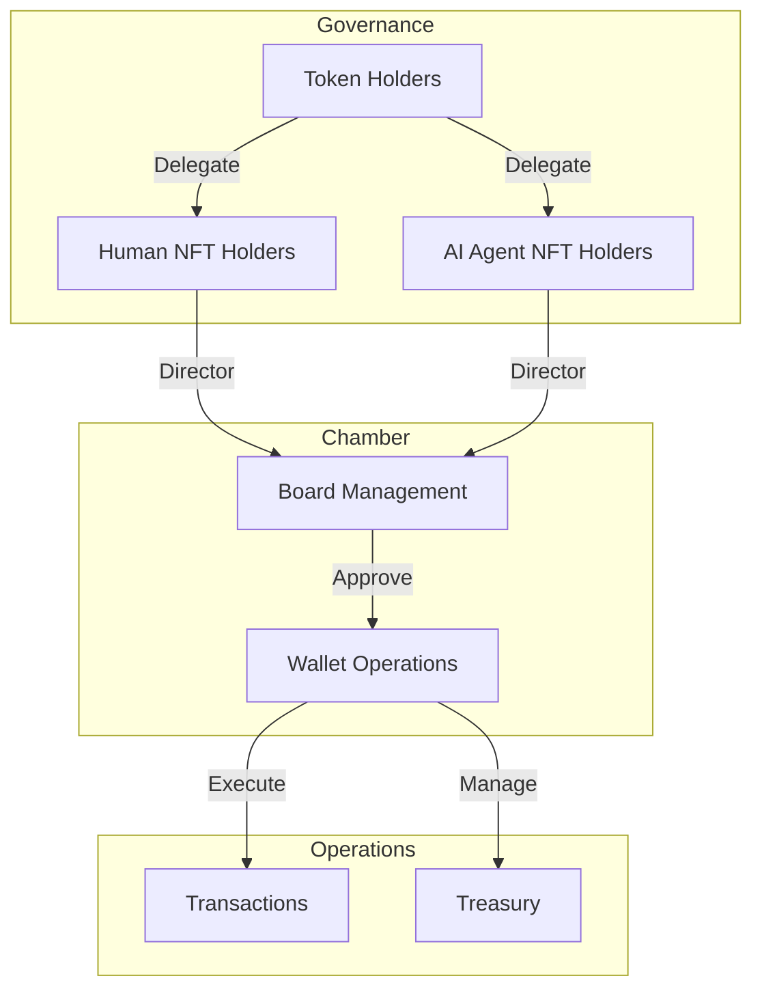

# Loreum Chamber

Loreum is a secure shared vault for communities. NFT holders elect a board of leaders who work together to manage funds and approve transactions through a unique delegation mechanism.

## Overview

The Chamber represents a novel smart account architecture that fundamentally reimagines organizational governance through three integrated components:
- Board management
- Wallet operations
- Delegation mechanics

### Key Features

- Market-driven governance through token delegation
- Hybrid human-AI decision making
- Multi-signature security
- Flexible extensibility through SubDAOs

## Architecture

### Board System
- Maintains an ordered ranking of leaders based on delegated voting power
- Automatically reorders positions when delegation amounts change
- Tracks director status for the top N positions

### Wallet System
- Multi-signature transaction management
- Quorum-based approval system
- Batch transaction support
- Revocable transaction confirmations

### Delegation System
- Market-driven leadership selection
- Fluid reallocation of voting power
- Double-entry bookkeeping for delegations
- Immediate withdrawal capabilities

## Contract Addresses

### Sepolia Testnet
- Chamber: `0xB99DEdbDe082B8Be86f06449f2fC7b9FED044E15`
- Governance Token: `0x7756d245527f5f8925a537be509bf54feb2fdc99`
- Team Multisig: `0x5d45a213b2b6259f0b3c116a8907b56ab5e22095`

## Documentation

For detailed documentation, visit [docs.loreum.org](https://docs.loreum.org)

## Community

- Discord: [Join our Discord](https://discord.gg/Pb3d5hRV)
- Twitter: [@loreumdao](https://twitter.com/loreumdao)
- GitHub: [loreum-org](https://github.com/loreum-org)

## License

MIT License

== Logs ==
  Registry deployed at: 0x9fE46736679d2D9a65F0992F2272dE9f3c7fa6e0
  MockERC20 deployed at: 0xCf7Ed3AccA5a467e9e704C703E8D87F634fB0Fc9
    Name: Mock Token
    Symbol: MOCK
    Initial Supply: 1000000 tokens
  MockERC721 deployed at: 0xDc64a140Aa3E981100a9becA4E685f962f0cF6C9
    Name: Mock NFT
    Symbol: MNFT