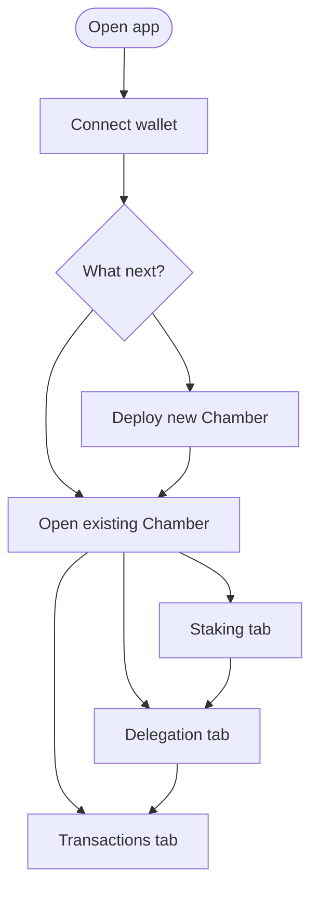

# Where everything is in the app

This is a **map of screens** in the Chamber web app. Pair it with **[Getting started](../introduction/getting-started.md)** for a walk-through.

## Main routes

| Path | What you do here |
|------|------------------|
| **`/`** | **Dashboard** — list Chambers from the Registry |
| **`/deploy`** | **Create** a new Chamber |
| **`/chamber/:address`** | **Overview** — summary, tabs, balances |
| **`/chamber/:address/staking`** | **Deposit / withdraw** underlying tokens |
| **`/chamber/:address/delegation`** | **Delegate** shares to NFT token IDs |
| **`/chamber/:address/transactions`** | **Proposal queue** (directors) |
| **`/chamber/:address/director/:tokenId`** | View tied to one **membership token ID** |
| **`/docs`** | This documentation |

## Who sees what?

| Action | Who |
|--------|-----|
| Deposit, withdraw, delegate | Anyone with tokens and shares |
| Submit / confirm / execute proposals | **Directors** only (top-seat NFT controllers) |
| Deploy a Chamber | Anyone on a network where Registry is configured |

The app checks **onchain** whether your wallet controls a seated NFT before showing director controls.

## Typical journey

## Read next

- **[Getting started](../introduction/getting-started.md)**  
- **[Governance](../protocol/governance.md)**  
- **[Treasury actions](../protocol/multisig.md)**  
