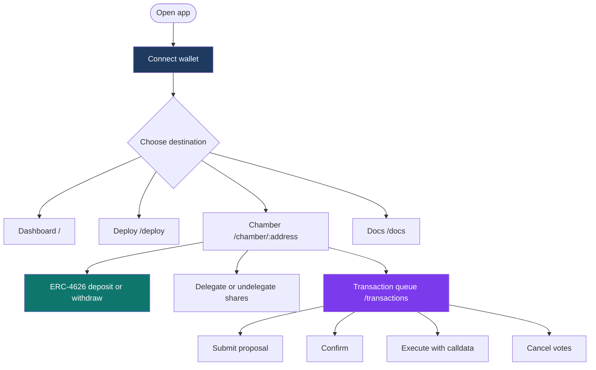

# App routes and flows

Technical map of URLs in **this** web client (basename-aware). Precise labels change with UX releases; **contract behavior** stays aligned with **`IChamber`** and related interfaces.

For a conversational introduction to Chambers, see **[Overview](../introduction/overview.md)**.

| Path | Purpose |
|------|---------|
| **`/`** | Dashboard — discovers chambers from the configured Registry |
| **`/deploy`** | Deploy a new Chamber |
| **`/chamber/:address`** | Chamber overview and tabs |
| **`/chamber/:address/:tab`** | Deeplink into a tab |
| **`/chamber/:address/transactions`** | Transaction queue |
| **`/chamber/:address/director/:tokenId`** | Director-centric view |
| **`/docs`**, **`/docs/*`** | This documentation tree |

Director-only controls appear when authentication matches **`isDirector(tokenId)`** for a token ID in the current top seats; share-holder actions (deposit, delegate) depend on balances and allowances.

## Read next

- **[Getting started](../introduction/getting-started.md)** — user-oriented walk-through  
- **[Governance](../protocol/governance.md)** — queue semantics and quorum  
- **[Multisig / wallet behavior](../protocol/multisig.md)** — calldata hashing and execution  
