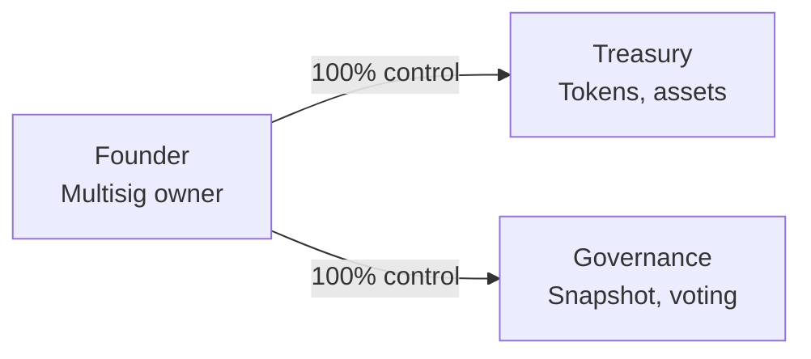
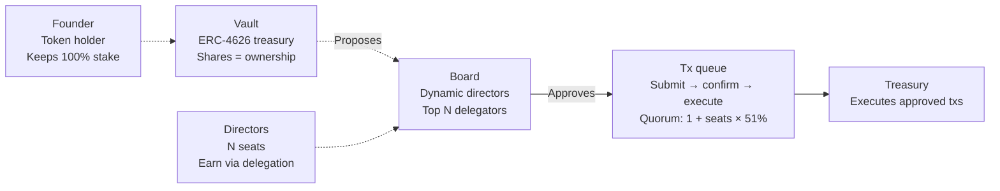

# DeFi protocol founder exit

How a Chamber separates **operational control** from **capital stake** during a governance transition — and why that strengthens **token utility** for everyone who stays.

> **Not legal advice.** Large founder holdings, transition timing, and securities treatment vary by jurisdiction. Consult qualified counsel before announcing or executing a governance change.

## The core tension

Most DeFi founders who want to step back from day-to-day operations face an **all-or-nothing** choice: keep full multisig control, or exit completely and lose operational influence.

A Chamber offers a third path: **gradual handoff** while the founder **retains token upside** and the community gains **real operational leverage** through delegation.

## The problem

Founders who want to move on usually hit three broken paths:

| Path | What goes wrong |
|------|-----------------|
| **Multisig control** | The founder holds all signing keys. Exit means transferring keys and losing operational influence. |
| **Snapshot voting** | Votes are symbolic — no execution rights. The treasury still needs a multisig for actual transfers. |
| **Token holdings** | Selling loses upside. Keeping tokens means watching the protocol evolve without control. |

No existing path reliably lets a founder:

- Exit day-to-day operations while retaining economic upside  
- Ensure new operators are aligned with protocol success  
- Keep strategic influence without unilateral blocking authority  
- Transition gradually instead of a hard cutover  

## Before Chambers: founder controls everything

| Metric | Value |
|--------|-------|
| Control points | 3 (multisig, treasury, governance) |
| Founder votes | 100% |
| Community power | 0% |
| Exit path | None |

## Chambers architecture

Three onchain components separate **capital ownership** from **operational control**:

### Key mechanics

**Liquid delegation** — Redelegate or undelegate at any time. No lockups; delegation is fully fluid and onchain.

**Fluid director status** — Board seats follow delegation rank. More delegation automatically earns a director seat.

See **[Governance](../protocol/governance.md)** for seats, quorum, and delegation in plain language.

## Why Chamber strengthens token utility

Most protocol tokens only confer **price exposure** or **symbolic governance**. In a Chamber, the token stack — **vault shares** plus **delegation toward membership NFTs** — is the path to who actually runs the protocol and moves the treasury.

| Point | What it means |
|-------|----------------|
| **Delegation is operational power** | Vault shares delegate toward membership NFTs. The highest-weight seats become directors who submit, confirm, and execute treasury transactions — not advisory votes. |
| **Hold without going passive** | Token holders keep economic exposure and can redirect influence at any time. Utility comes from holding and delegating, not from selling to participate. |
| **Onchain leadership ladder** | Delegation totals and seat ranking are public contract state. Anyone can see who leads, how much weight they carry, and what quorum is required to move funds. |

### Governance model vs. token utility

| Model | What the token gives holders | Who controls operations |
|-------|------------------------------|-------------------------|
| Multisig + token | Price exposure | Static signers (often off-token) |
| Snapshot + token | Signaling votes | Separate multisig executes |
| **Chamber** | **Delegation → board seats** | **Token weight → queued execution** |

For a founder exit, this matters twice: the founder can step back while keeping stake, and the remaining token becomes more valuable because holders gain a **real lever** over protocol operations — not just a vote that still needs a multisig to act.

## Exit mechanism

Four phases — founder control fades as community delegation grows.

### 1. Deploy Chamber

Create Vault, Board (N seats), and Transaction Queue. Transfer treasury assets into the Vault.

**Flow:** Vault → Board → Queue

### 2. Onboard directors

Recruit qualified operators. The founder delegates a portion of tokens to establish the initial Board.

**Flow:** Founder delegates to D1, D2, D3

### 3. Reduce founder delegation

The founder drops below the director threshold. Directors maintain seats via community delegation.

**Flow:** Founder stake retained; board earns delegation

### 4. Founder becomes token holder

The founder keeps economic stake but no longer controls operations. The community governs via the Board.

**Flow:** Stake (no vote) → Board controls treasury

## Economic position post-exit

### Founder retains

| Item | Outcome |
|------|---------|
| Token holdings | 100% retained |
| Treasury upside | Proportional to stake |
| Future appreciation | Full exposure |
| Governance votes | Optional if delegated |
| Board proposals | Can still submit |

### Founder gives up

| Item | Outcome |
|------|---------|
| Unilateral tx approval | Quorum required |
| Treasury signers | Board controls |
| Direct operational power | Delegated to directors |
| Veto capability | Democratic process |
| Protocol direction | Shared governance |

### Capital vs. control

| Scenario | Founder control | Founder stake | Operational exit |
|----------|-----------------|---------------|------------------|
| Multisig (today) | 100% | 100% | Full exit only |
| Chambers (ideal) | 0% | Variable | Gradual exit |
| Chambers (minimal) | Vote only | 100% | Partial exit |

## Benefits

**Gradual transition** — Reduce delegation incrementally; reclaim control if needed.

**Aligned incentives** — Directors must earn community delegation or lose their seat.

**Upside preserved** — Token holdings appreciate with protocol success; no forced sell pressure during transition.

**Community trust** — A visible transition demonstrates commitment to decentralization.

**Reversibility** — Liquid delegation lets the founder re-delegate if the community asks.

## Risks

**Director capability** — New directors may lack founder expertise. Plan onboarding and a transition period.

**Quorum friction** — Getting `1 + (seats × 51%)` approvals may slow decisions initially. Community engagement is required.

**Price volatility** — Exit announcements may move markets. Mitigate with clear communication.

**Capture risk** — Directors could collude. Liquid delegation is the community escape hatch.

**Regulatory uncertainty** — Large founder holdings may trigger securities review. Consult legal counsel.

## Summary

| | |
|---|---|
| **Problem** | All-or-nothing control — full operational power or complete exit |
| **Solution** | Liquid delegation separates capital from operations |
| **Outcome** | Founder exits operations while preserving stake and optional governance influence |

Chambers lets a protocol founder exit day-to-day operations while preserving token upside and optional governance influence through delegation.

## Where to go next

1. **[What is a Chamber?](./overview.md)** — the three-part mental model  
2. **[Why not just a multisig?](./why-not-multisig.md)** — side-by-side comparison  
3. **[Governance](../protocol/governance.md)** — seats, quorum, delegation  
4. **[Getting started](./getting-started.md)** — deploy and use the app  
