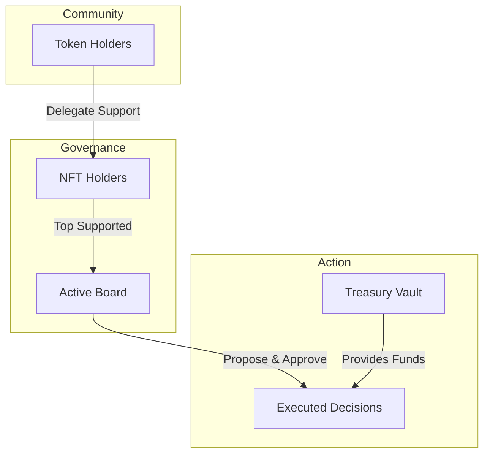

# Welcome to Loreum Chamber

Loreum Chamber is a digital command center for organizations, communities, and treasuries. It combines a secure vault with a dynamic governance system that ensures your community’s assets are managed by the leaders they trust most.

At its heart, a Chamber is a **Smart Vault** where a "Board of Directors" makes decisions together. Unlike traditional systems, this Board isn't fixed—it shifts in real-time based on the support of the community.

## Why Use a Chamber?

Traditional community wallets (like multisigs) can be rigid. When a member leaves or a new leader emerges, updating the wallet can be slow and complicated. 

**Chamber solves this by being dynamic:**
- **Community-Led**: Token holders decide who sits on the Board by delegating their support.
- **Dynamic Leadership**: As community sentiment changes, the Board updates automatically.
- **High Security**: No single person can move funds. Every action requires a "Quorum" (a majority) of the Board to agree.
- **Transparency**: Every deposit, delegation, and transaction is recorded on the blockchain for everyone to see.

## How It Works

A Chamber operates through a simple but powerful cycle of support and action:

### 1. The Vault
The Chamber holds your community's assets (like ETH or other tokens). When you contribute to the vault, you receive "Shares" that represent your stake in the community.

### 2. The Board
Every Chamber has a set number of "Seats" (for example, 5 or 7). These seats are filled by holders of a special community NFT. These are your Directors.

### 3. Delegation (Your Voice)
If you hold community shares, you can "Delegate" them to any NFT holder you trust. The NFT holders with the most delegated support automatically take the seats on the Board. You can move your support at any time if you change your mind.

### 4. Proposals and Execution
Directors propose actions—like sending funds to a contributor or investing in a new project. Other Directors must then "Confirm" these actions. Once enough Directors agree, the transaction is executed automatically.

## The Big Picture

Whether you are a DAO, a small investment club, or a large international organization, Chamber provides the tools to manage your future together.

