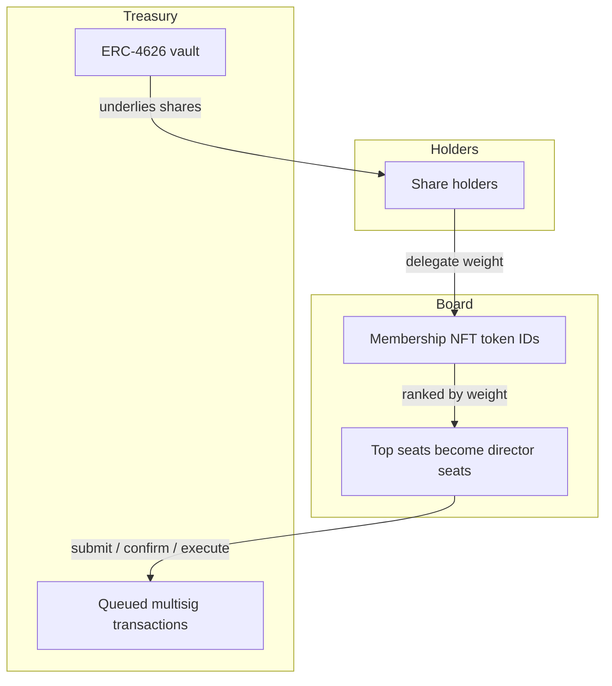

# Welcome to Loreum Chamber

Chamber is a **tokenized vault** (ERC‑4626) paired with **membership NFTs** and a **delegation-weight leaderboard**. Share holders point their balance at specific NFT token IDs; the strongest-backed IDs occupy a fixed number of **seats**. The owners of those seats act as **directors**, coordinating outbound calls through an on-chain **transaction queue** with **quorum** approval.

The Board is **dynamic**: as delegations change, the set of top token IDs (and therefore who can govern) updates without a manual multisig signer list.

## Why use it?

- **Liquid membership** — Treasury shares are standard ERC‑20; deposit and redeem against a chosen underlying ERC‑20.  
- **Representative weight** — Delegation ties voting weight to recognizable NFT token IDs instead of anonymous EOAs only.  
- **Multisig-style execution** — Directors submit `target`, `value`, and calldata; confirmations must meet quorum; execution verifies stored calldata hashes.  
- **Upgradeable instances** — Each Chamber is a **transparent proxy**; upgrade rights are mediated through **`ProxyAdmin` ownership** transferred from the **[Registry](../protocol/architecture.md)** at creation.  

## How it fits together

### 1. Vault (ERC‑4626)

The Chamber custody layer is ERC‑4626 over a single underlying asset. You receive Chamber **share tokens** when you deposit. Shares are the unit you **delegate** toward NFT token IDs.

### 2. Membership (ERC‑721)

Each Chamber is configured with one **membership ERC‑721**. A **director** is not “any NFT holder”—they must hold a token ID that is currently in the **top `seats` positions** on the delegation leaderboard, and they must prove control of that token when acting (EOA owner or [EIP‑1271](https://eips.ethereum.org/EIPS/eip-1271) for contract wallets).

### 3. Delegation

Share holders call **`delegate(tokenId, amount)`** and **`undelegate`**. Total delegated per holder cannot exceed their Chamber share balance; transfers and withdrawals respect the same constraint so voting weight cannot be double-spent.

### 4. Transaction queue

Directors **`submitTransaction`**, peers **`confirm`**, and anyone eligible may **`execute`** once quorum is met. Only **`keccak256(calldata)`** is stored on-chain—**callers must retain or recover the original calldata** (e.g. from `SubmitTransaction` events) to execute.

```mermaid
graph TD
    subgraph Holders
        S[Share holders]
    end
    subgraph Board
        N[Membership NFT token IDs]
        D[Top seats become director seats]
    end
    subgraph Treasury
        V[ERC-4626 vault]
        Q[Queued multisig transactions]
    end
    S -->|delegate weight| N
    N -->|ranked by weight| D
    D -->|submit / confirm / execute| Q
    V -->|underlies shares| S
```

## Where to go next

- **[Getting started](./getting-started.md)** — using the web app  
- **[Governance](../protocol/governance.md)** — quorum formula, seat changes, cancellation  
- **[Design notes](../protocol/design-notes.md)** — exact on-chain rules and limits  
