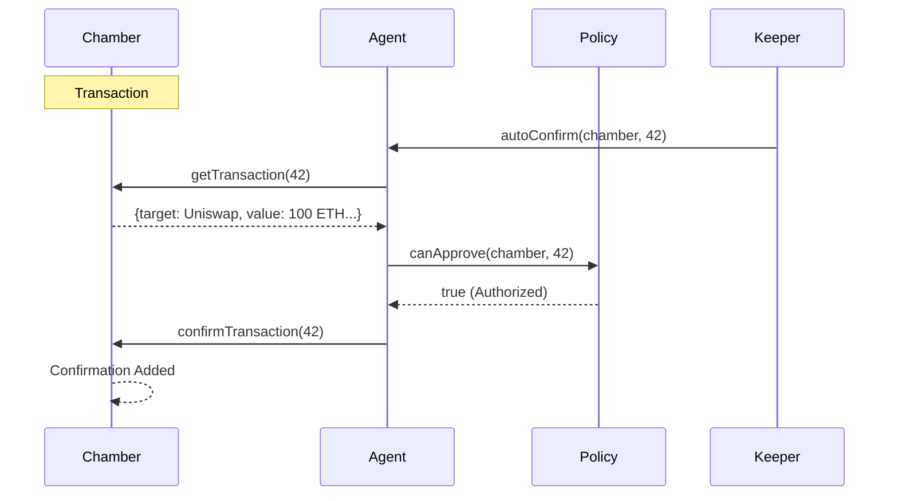

# Architecture: Agent-Driven Governance

Chamber Protocol introduces a novel "Hybrid Smart Account" governance model where Board Directors can be programmable smart contracts (Agents) rather than just human EOAs.

## Core Components

### 1. The Chamber (`Chamber.sol`)
The central hub combining Vault, Board, and Wallet.
- **Upgrade**: Now supports **EIP-1271** signature validation in the `isDirector` modifier.
- **Logic**: If a Director is a smart contract, the Chamber asks it: *"Do you authorize this action?"*

### 2. The Agent (`Agent.sol`)
An ERC-8004 inspired Smart Account that holds the Director NFT (or is the delegated leader).
- **Role**: Sits on the Board of Directors.
- **Brain**: Contains a `IAgentPolicy` module that dictates its voting behavior.
- **Automation**: Can be triggered by Keepers (Chainlink/Gelato) to auto-confirm transactions that meet its policy.

### 3. The Registry (`Registry.sol`)
Factory for deploying both Chambers and Agents.
- Ensures Agents use verified implementations for security.

## Governance Flow



## EIP-1271 Integration

To allow Agents to participate in governance (both on-chain and via off-chain signatures), the `Chamber` checks signatures using EIP-1271:

```solidity
// In Chamber.sol
if (director.code.length > 0) {
    bytes4 magic = IERC1271(director).isValidSignature(hash, signature);
    require(magic == 0x1626ba7e, "Invalid Contract Signature");
}
```

This enables **Gasless Voting** and **Delegated Signing** where an Agent can authorize a relayer to vote on its behalf.
