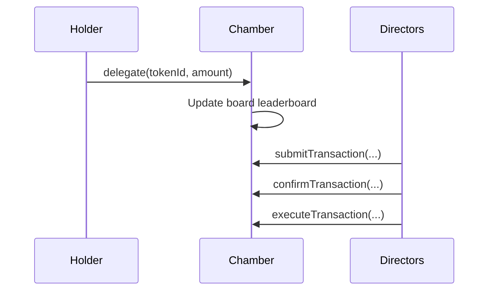

# Architecture: Chamber Governance

Chamber packages vault custody, director ranking, and a multisig-style Wallet into one upgradeable contract.

## Core Components

### Chamber (`Chamber.sol`)

Combines ERC-4626 vault logic, Board leaderboard governance, and Wallet transaction lifecycle.

### Registry (`Registry.sol`)

Deploys Chamber proxies against a pinned implementation and transfers ProxyAdmin ownership to each Chamber.

### EIP-1271 on directors

When a director address has contract code, `Chamber` may validate signatures via EIP-1271 so smart-contract wallets can participate alongside EOAs—without requiring a separate agent runtime in this codebase.

## Governance Flow

```mermaid
sequenceDiagram
    participant Holder
    participant Chamber
    participant Directors

    Holder->>Chamber: delegate(tokenId, amount)
    Chamber->>Chamber: Update board leaderboard

    Directors->>Chamber: submitTransaction(...)
    Directors->>Chamber: confirmTransaction(...)
    Directors->>Chamber: executeTransaction(...)
```
