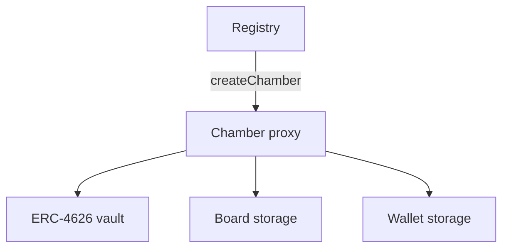

# How the contracts fit together

> **Audience:** newcomers can skip this page. It is for builders who want a map of **what runs onchain** after reading **[What is a Chamber?](../introduction/overview.md)**.

A Chamber is **one proxy address** that combines:

| Piece | File (concept) | Job |
|-------|----------------|-----|
| **Vault** | ERC‑4626 in `Chamber` | Share accounting |
| **Board** | `Board` mixin | Delegation leaderboard + seats |
| **Wallet** | `Wallet` mixin | Proposal queue |
| **Registry** | `Registry` | Deploy new Chamber proxies |

```mermaid
flowchart TB
  R[Registry]
  R -->|createChamber| P[Chamber proxy]
  P --> V[ERC-4626 vault]
  P --> B[Board storage]
  P --> W[Wallet storage]
```

## Chamber proxy

- Initialized with **underlying ERC‑20**, **membership ERC‑721**, **seat count**, and share **name/symbol**.  
- **Upgradeable** — logic changes go through **`upgradeImplementation`**, normally as a queued transaction.  
- **`ProxyAdmin` ownership** is transferred to the Chamber itself after Registry deploy (so upgrades are also director-gated).

## Registry

- Stores the **implementation** used for new Chambers.  
- **`createChamber`** deploys a new transparent proxy, initializes it, indexes it, and wires optional **parent/child** links.  
- **`ADMIN_ROLE`** can update the implementation pointer for **future** deploys (does not auto-upgrade existing Chambers).

## Offchain app

The web app (`app/`) reads Registry and Chamber state and sends transactions users sign in their wallet — deposit, delegate, queue actions.

## Registry vs lab deploy scripts

Production-shaped flows use **`Registry.createChamber`**. Standalone Chamber deploy scripts in `contracts/script/` may leave **ProxyAdmin** with a different owner — fine for local experiments; **not** the product default.

## Read next

- **[Governance](./governance.md)** — behavior in plain language  
- **[Design notes](./design-notes.md)** — storage layout and limits  
- **[Deployment](../guides/deployment.md)** — Foundry commands  
- **[API reference](../reference/api-reference.md)**  
