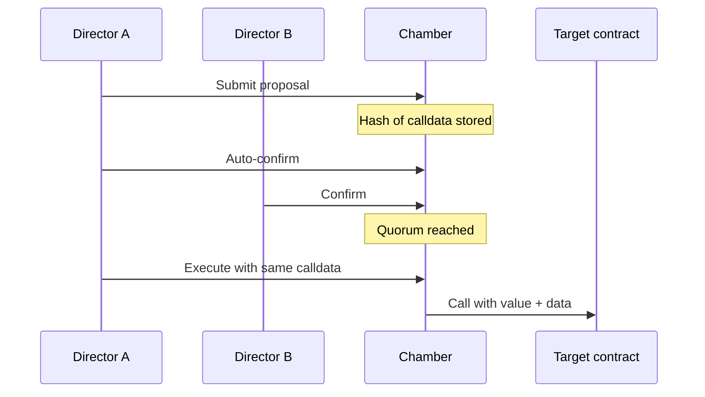

# Treasury actions (the proposal queue)

This is how a Chamber **spends** — the closest equivalent to **creating a transaction in Gnosis Safe**, but with **director confirmations** instead of a fixed signer list.

## The lifecycle in plain language

1. **Submit** — a director proposes: send ETH to an address, or call another contract with calldata.  
2. **Confirm** — other directors add confirmations until **quorum** is met.  
3. **Execute** — someone submits the **exact calldata** again; the contract verifies it matches the stored **hash**, then runs the call.

If calldata does not match, execution **reverts** (`DataHashMismatch`).

## Why only a hash is stored onchain

Full calldata can be large and expensive to store. Chamber stores **`keccak256(calldata)`** and emits the **full calldata in an event** at submit time so apps and indexers can archive it.

**You must keep the original calldata** (copy from the app, logs, or your records) to execute later — same discipline as saving Safe transaction data, but enforced by the contract.

## Who can participate?

Only **current directors** (top-seat NFT controllers) may submit, confirm, execute, revoke confirmations, or vote to cancel.

## Compared to a multisig

| Step | Gnosis Safe (typical) | Chamber |
|------|----------------------|---------|
| Create tx | Any signer proposes | Director **submits** |
| Approve | Signers sign offchain/onchain | Directors **confirm** onchain |
| Threshold | Fixed M-of-N signers | **Quorum** from seat count |
| Signer set | Manual updates | **Delegation** updates seats |
| Calldata | Held in Safe UI | Hash onchain; calldata from events |

## Cancelling a proposal

Directors can vote to **cancel** before execution. Enough cancel votes (quorum) marks the proposal **cancelled** — no more confirmations, no execution.

## Upgrades (special case)

A proposal may target **the Chamber itself** only for **`upgradeImplementation`** — the controlled path to upgrade the contract logic via **ProxyAdmin**. Random self-calls are blocked.

## Batching

Directors can submit, confirm, or execute **many proposals in one transaction** to save gas. If any step in a batch fails, the **whole batch** reverts.

## Safety

External entrypoints use **reentrancy guards**. Execution follows **checks-effects-interactions**: mark executed, then call out; revert and roll back if the call fails.

## Read next

- **[Governance](./governance.md)** — quorum and seats  
- **[Getting started](../introduction/getting-started.md)** — Transactions tab  
- **[Why not just a multisig?](../introduction/why-not-multisig.md)**  
