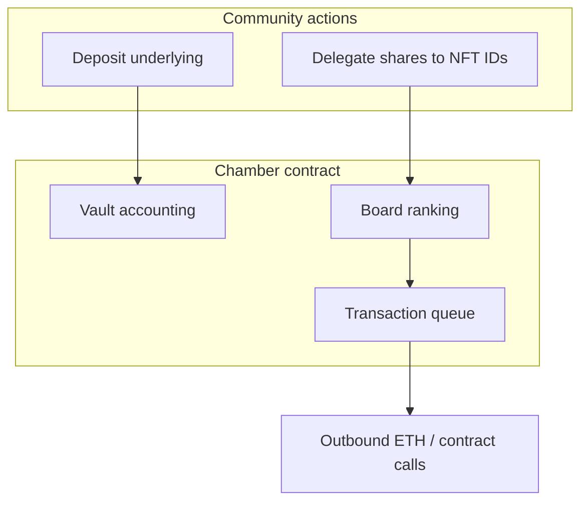

# Why Chamber is built this way

Chamber exists because many communities duct-tape three jobs together:

1. **Treasury** — hold and account for pooled assets.  
2. **Leadership** — decide who speaks for the group **this month**.  
3. **Execution** — actually move funds or call contracts **only when enough leaders agree**.

A plain **multisig** handles (3) well with a **fixed signer list**. It usually does **not** solve (1) and (2) onchain. Chamber merges all three into **one upgradeable contract** per deployment.

## The three primitives

| Primitive | Plain-language job | Multisig analogy |
|-----------|-------------------|------------------|
| **Vault (ERC‑4626)** | Shared treasury with **shares** | Everyone’s balance in one “cap table” contract |
| **Board** | **Delegation leaderboard** picks director **seats** | A signer list that **re-sorts** when power shifts |
| **Wallet (queue)** | **Submit → confirm → execute** with quorum | Safe transaction queue with **director** confirmations |

## Design goals (for humans reading contracts)

- **Legibility** — an outsider can read seats, quorum, and queued proposals from chain data.  
- **Liquidity of influence** — delegation changes without redeploying a Safe.  
- **Enforced execution** — approvals are **confirmations on a nonce**, not a separate offchain vote.  
- **Composable orgs** — Sub-Chambers and Registry indexing for teams that outgrow one pot.  

Agents, analytics, and dashboards sit **around** these interfaces. They do not replace onchain quorum or vault accounting.

## Read next

- **[What is a Chamber?](../introduction/overview.md)**  
- **[Why not just a multisig?](../introduction/why-not-multisig.md)**  
- **[Architecture](./architecture.md)** — contracts and Registry (builders)  
- **[Whitepaper](https://loreum.org/whitepaper)** — long-form narrative  
