# Sequence Diagrams

This document contains Mermaid sequence diagrams and swimlane diagrams illustrating key workflows in the Chamber system.

## Table of Contents

1. [System Overview Swimlane](#system-overview-swimlane)
2. [Chamber Deployment](#chamber-deployment)
3. [Delegation Flow](#delegation-flow)
4. [Transaction Submission and Execution](#transaction-submission-and-execution)
5. [Seat Update Proposal](#seat-update-proposal)
6. [Director Selection](#director-selection)
7. [Deposit and Withdrawal](#deposit-and-withdrawal)

---

## System Overview Swimlane

This swimlane diagram shows the complete transaction flow across all system components.

### Sequence Diagram View

This sequence diagram shows the complete flow with all participants:

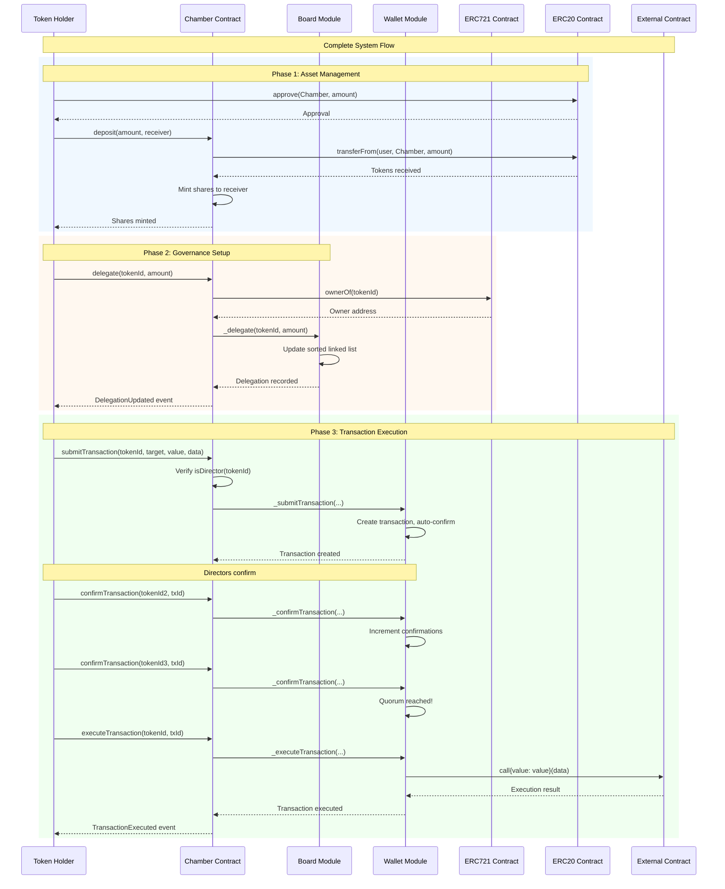

### Flowchart Swimlane View

This flowchart swimlane diagram shows the system architecture and data flow:

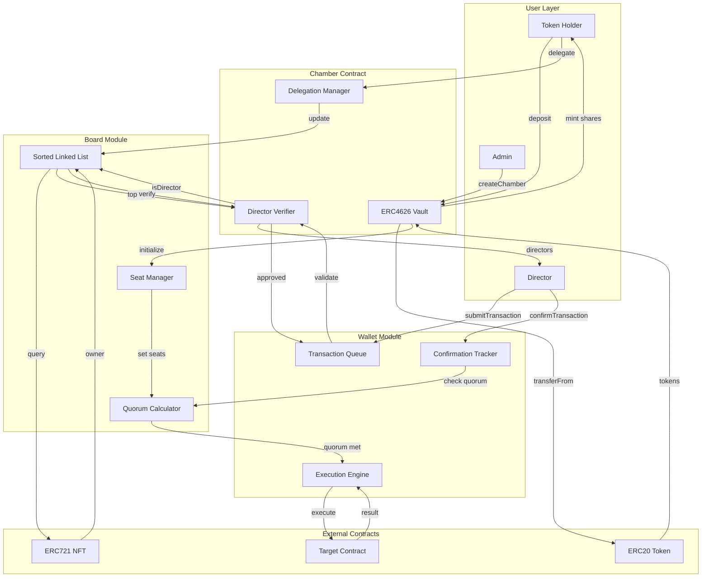

### Process Swimlane Diagram

This diagram shows the process flow with swimlanes for each component:

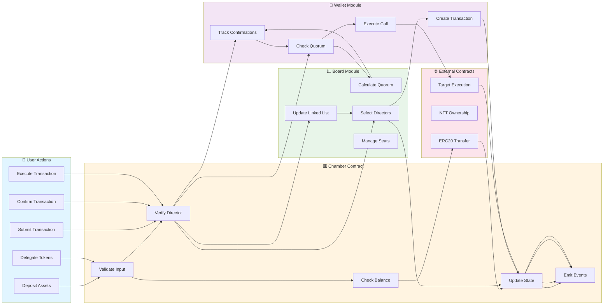

---

## Chamber Deployment

This diagram shows how a new Chamber is deployed through the Registry.

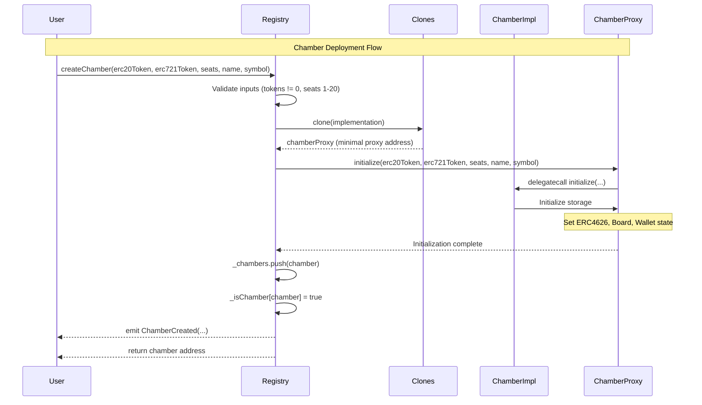

---

## Delegation Flow

This diagram shows how token holders delegate voting power to NFT token IDs.

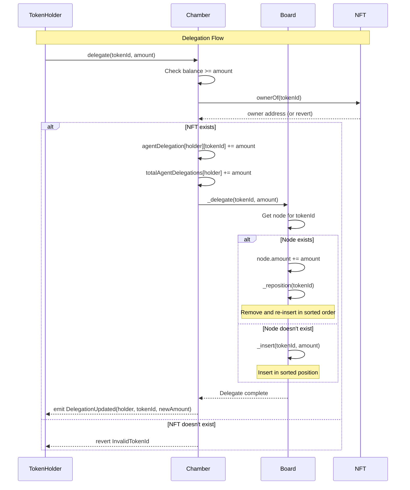

---

## Transaction Submission and Execution

This diagram shows the complete flow of submitting, confirming, and executing a multisig transaction.

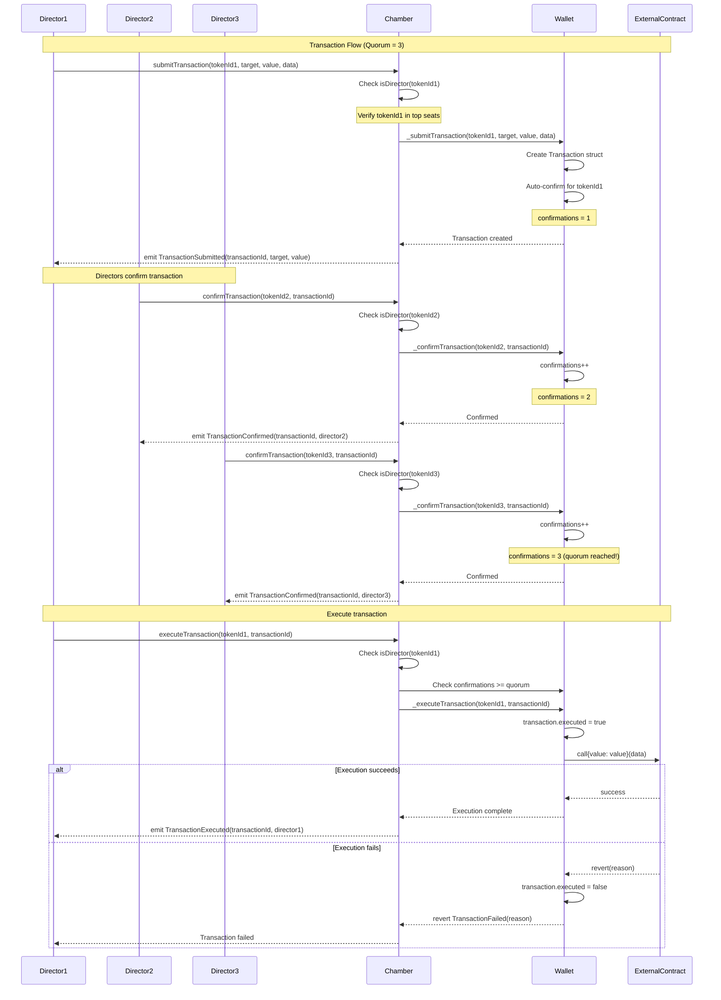

---

## Seat Update Proposal

This diagram shows how directors propose and execute seat updates with timelock and quorum requirements.

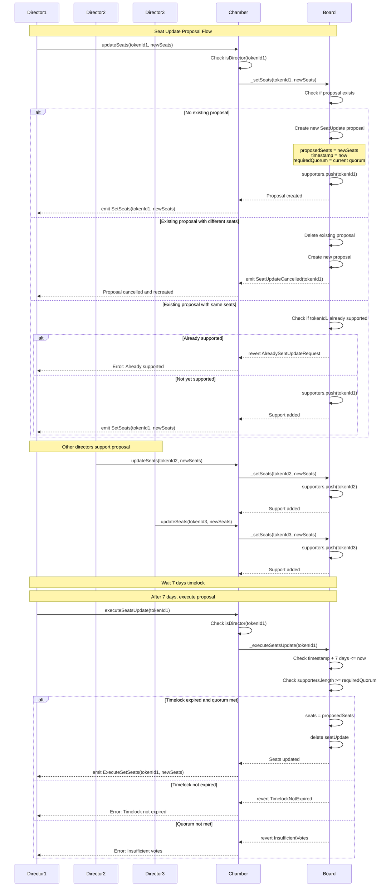

---

## Director Selection

This diagram shows how directors are selected from the top delegations.

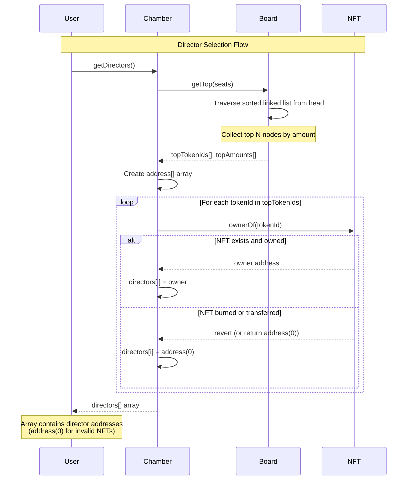

---

## Deposit and Withdrawal

This diagram shows ERC4626 deposit and withdrawal flows with delegation checks.

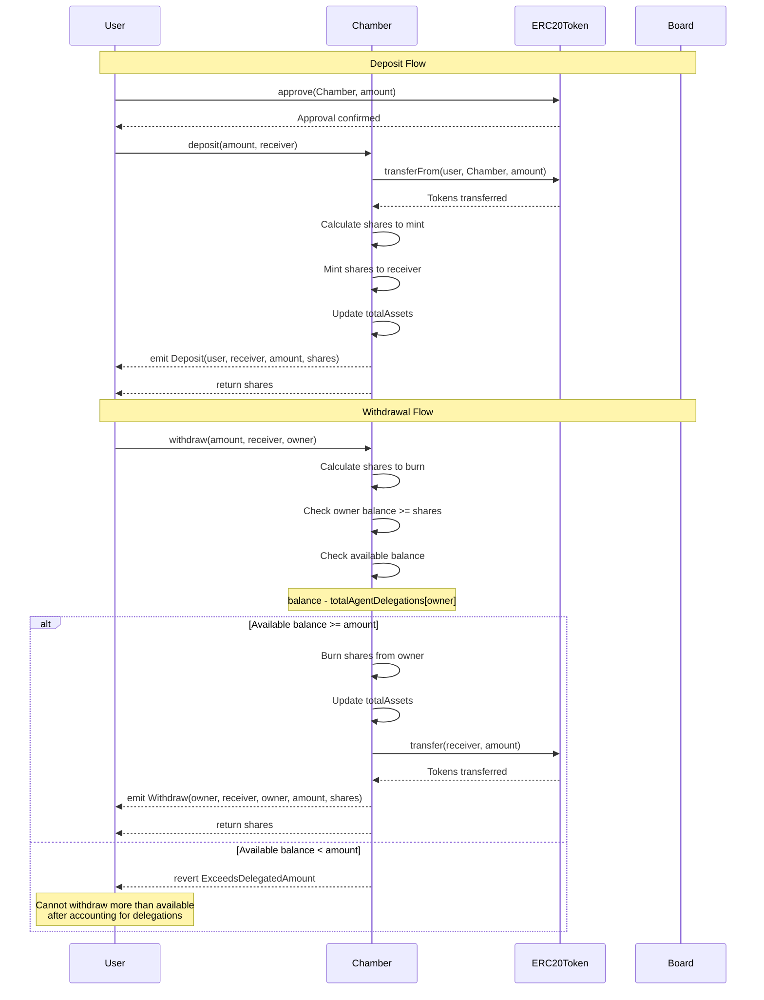

---

## Batch Transaction Flow

This diagram shows how batch operations work for multiple transactions.

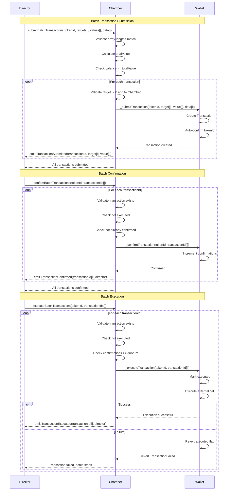

---

## Undelegation Flow

This diagram shows how token holders undelegate voting power.

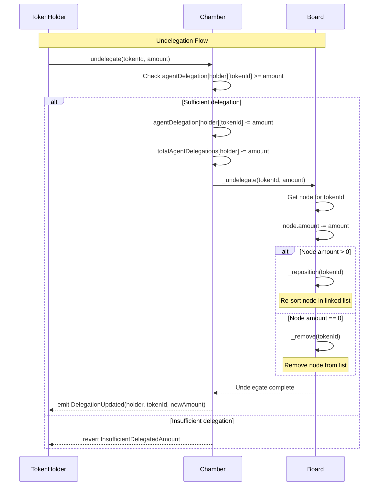

---

## Notes on Diagrams

### Swimlane Format

These diagrams use standard sequence diagrams rather than swimlanes. For swimlane format, you can convert them using Mermaid's `participant` grouping or by using a different diagram type.

### Key Patterns Illustrated

1. **Delegation**: Shows how delegations update the sorted linked list
2. **Multisig**: Demonstrates quorum-based transaction approval
3. **Timelock**: Shows seat update proposal with 7-day delay
4. **Director Selection**: Illustrates how top delegations determine directors
5. **Batch Operations**: Shows efficient batch processing
6. **Error Handling**: Includes error paths and validation checks

### Diagram Usage

These diagrams can be:
- Rendered in Markdown viewers that support Mermaid
- Exported to PNG/SVG using Mermaid CLI
- Embedded in documentation websites
- Used for code reviews and architecture discussions
