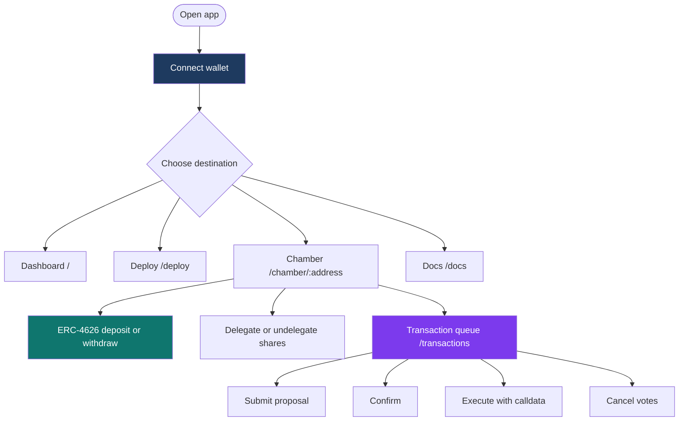

# App interface flow

Routes from **`App.tsx`** (basename-aware):

| Path | Purpose |
|------|---------|
| **`/`** | Dashboard — chamber discovery from Registry |
| **`/deploy`** | Deploy a new Chamber (chain + env dependent) |
| **`/chamber/:address`** | Chamber overview + tabs |
| **`/chamber/:address/:tab`** | Deeplink to tab |
| **`/chamber/:address/transactions`** | Transaction queue UX |
| **`/chamber/:address/director/:tokenId`** | Director-centric view |
| **`/docs`**, **`/docs/*`** | In-app Markdown docs |

Director-only actions unlock when wallet auth matches **`isDirector(tokenId)`** for a token in the current top seats; share-only actions (deposit, delegate) depend on balances and approvals.

This diagram is illustrative; precise button labels evolve with UI releases while on-chain semantics remain **`IChamber`**.
