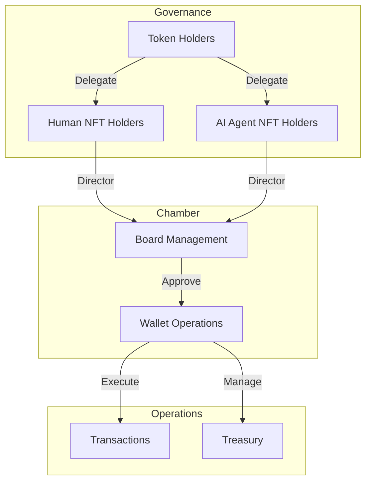

# Overview

Loreum Chamber is a secure shared vault for communities. NFT holders elect a board of leaders who work together to manage funds and approve transactions through a unique delegation mechanism.

The Chamber represents a novel smart account architecture that fundamentally reimagines organizational governance through three integrated components:
- **Board management**
- **Wallet operations**
- **Delegation mechanics**

## Key Features

- **Market-driven governance**: Voting power is delegated to NFT holders in real-time.
- **Leaderboard of Directors**: Stakeholders delegate governance power to specific NFT IDs, representing roles or members.
- **Hybrid human-AI decision making**: Agents and humans can share governance power.
- **Multi-signature security**: Quorum-based transaction management.
- **Flexible extensibility**: Supports a plug-and-play architecture for modular growth.

## High-Level Vision

The Chamber is built on two main ecosystems, promoting extensibility and open-source contributions:

### 1. Sensor Hub
The data ingestion and processing layer. It connects to real-time data sources (blockchain events, market prices) and fetch-requested data (APIs, historical datasets), providing agents with normalized data for decision-making.

### 2. Agent Hub
The platform for adding and managing modular agents. Agents are self-contained functionalities like trading bots, compliance checks, or analytics tools.

## System Architecture

