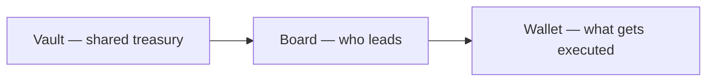

# What is a Chamber?

A **Chamber** is a **community treasury with built-in rules**. It holds tokens in a shared vault, lets members **delegate influence** toward recognizable **director seats**, and only spends or calls other contracts when **enough directors agree** through an onchain queue.

If you have used a **multisig wallet** (like Gnosis Safe), think of a Chamber as answering three questions that multisigs usually leave informal:

1. **Who holds economic weight in the group?** — tracked as vault **shares**, not just a static signer list.  
2. **Who actually leads day to day?** — the **top delegated membership NFTs** on a public leaderboard, not a founder’s spreadsheet.  
3. **What exactly was approved to run?** — each outbound action is **proposed, confirmed to quorum, then executed** with calldata checked against a stored hash.

Those rules live in **audited smart contracts**, not in a Discord poll or a hidden admin key.

## What you can do with a Chamber

| You want to… | Chamber gives you… |
|--------------|-------------------|
| Pool assets | An **ERC‑4626 vault** — deposit the configured token, receive **share tokens** representing your slice. |
| Influence leadership | **Delegation** — point your share weight at **membership NFT token IDs** you trust. |
| See who leads | A **Board** — the highest-weight token IDs fill a fixed number of **seats** (directors). |
| Move the treasury | A **transaction queue** — directors **submit**, **confirm**, and **execute** outbound calls only after **quorum**. |

## Who is a “director”?

A **director** is whoever controls a **membership NFT token ID** that currently sits in the **top seats** on the board. That can be:

- A person with a normal wallet  
- A **multisig contract** (still one seat on the board)  
- Over time, **software agents** that follow the same onchain rules as everyone else  

There is no separate “admin bypass” for day-to-day spending — the queue is the path.

## Why teams choose Chamber

Teams that outgrow a single founder multisig often hit the same walls:

- Signers are **hand-picked** and rarely update when power shifts.  
- **Discord or Snapshot** votes are not the same as **enforced** treasury execution.  
- Outsiders cannot easily answer: *who can move funds right now, under what threshold?*

Chamber pushes those answers into **onchain state**: delegation totals, seat ranking, quorum, and proposal hashes. That is **structural clarity** — useful for communities, contributors, and regulators who ask how governance actually works.

> **Not legal advice.** Statutes and supervisory guidance change. For formal protocol framing, see the **[Chamber Protocol whitepaper](https://loreum.org/whitepaper)**.

## The three parts (simple mental model)

- **Vault** — deposit and withdraw; shares represent ownership.  
- **Board** — delegation ranks **NFT token IDs**; top **N** seats are directors.  
- **Wallet** — directors queue **transactions** (send ETH, call contracts) with **quorum**.

## Sub-Chambers (bigger organizations)

One **root Chamber** can anchor the main treasury. **Sub-Chambers** are additional Chambers with their own vault and directors for focused mandates (treasury committee, operations, experiments). See **[Chambers and Sub-Chambers](./chamber-and-sub-chambers.md)**.

## Where to go next

1. **[Why not just a multisig?](./why-not-multisig.md)** — side-by-side comparison  
2. **[Getting started](./getting-started.md)** — use the web app  
3. **[Governance](../protocol/governance.md)** — seats, quorum, delegation in plain language  
4. **[Treasury actions](../protocol/multisig.md)** — the proposal queue vs Safe  
