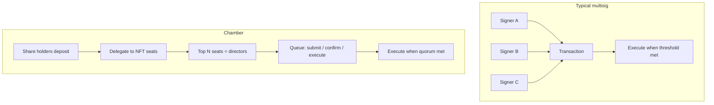

# Why not just a multisig?

Many DAOs start with a **multisig treasury** — often **Gnosis Safe** or a similar wallet where **N of M signers** must approve each transaction. That works for small teams. Chamber is for groups that want the **same safety idea** (multiple people must agree) but with **rules that update onchain** as power shifts.

This page compares the two in plain language. Nothing here is legal advice.

## What a normal multisig does well

A classic multisig is excellent when:

- You have a **fixed, trusted circle** of signers (for example five founders).  
- Changes are **rare** (add/remove signer only when someone leaves).  
- You mainly need **“send this transaction if 3 of 5 agree.”**

The wallet stores assets and enforces **signature thresholds**. Simple and battle-tested.

## Where multisigs often break down

As a community grows, teams usually notice:

| Pain point | What happens in practice |
|------------|-------------------------|
| **Static signer list** | Power moved to new contributors, but the Safe still lists last year’s five addresses. |
| **Offchain votes** | Discord or Snapshot says “yes,” but **execution** is still whoever holds keys. |
| **Opaque influence** | Token holders exist, but **who speaks for them** is informal. |
| **No shared accounting** | The Safe holds tokens, but **membership in the group** is not represented as fungible shares in the same contract. |

A multisig answers **“did enough signers click approve?”** It does not automatically answer **“who should be a signer this month?”** or **“how much economic weight backed this decision?”**

## What Chamber adds

| Question | Typical multisig | Chamber |
|----------|------------------|---------|
| Who can move funds? | Fixed signer addresses | **Directors** = top **delegated NFT seats** (changes as delegation changes) |
| How is membership represented? | Offchain / informal | **Vault shares** (deposit underlying → receive shares) |
| How do holders influence leaders? | Lobby signers | **Delegate** share weight to **NFT token IDs** on a public board |
| How are spends approved? | Collect signatures | **Submit → confirm to quorum → execute** (onchain queue) |
| Can outsiders audit the rules? | Signer list + policy docs | **Contract state + events** (seats, quorum, proposal hashes) |

Chamber does **not** remove human judgment — it **records** judgment in a structure meant to stay legible as the group evolves.

## Same safety pattern, different shape

Both designs share a core idea: **one person should not unilaterally drain the treasury.**

- **Multisig:** agreement is **signatures from a fixed list**.  
- **Chamber:** agreement is **confirmations from whoever currently holds director seats**, where seats follow **delegation**.

## When to stay on a multisig

Stay with a plain multisig if:

- You have **few signers** who rarely change.  
- You do **not** need onchain representation of **many contributors**.  
- You are fine with **governance living offchain** (votes in chat, execution by signers).

## When Chamber is a better fit

Consider a Chamber if:

- **Many people** deposit into a shared treasury and need **transparent share accounting**.  
- Leadership should **track delegation**, not a one-time signer CSV.  
- You want **proposal → quorum → execution** entirely **onchain** for major outbound actions.  
- You may grow into **Sub-Chambers** (treasury vs ops vs R&D) without one Safe holding everything.

## Can you use both?

Yes. A **multisig contract** can **own a membership NFT** and act as one **director seat** on the board. Humans might still use Safe internally; Chamber sees one **seat** with one voting path on the queue. See **[Chambers and Sub-Chambers](./chamber-and-sub-chambers.md)**.

## Read next

- **[What is a Chamber?](./overview.md)**  
- **[Getting started](./getting-started.md)**  
- **[Treasury actions](../protocol/multisig.md)** — how the queue works step by step  
- **[Governance](../protocol/governance.md)** — seats and quorum  
